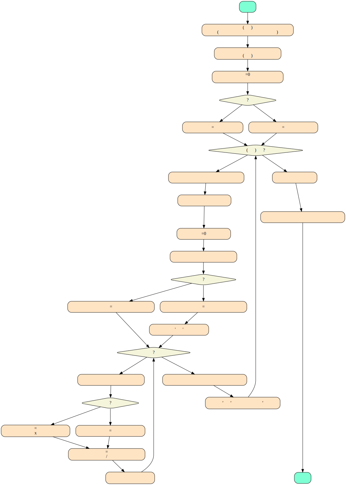
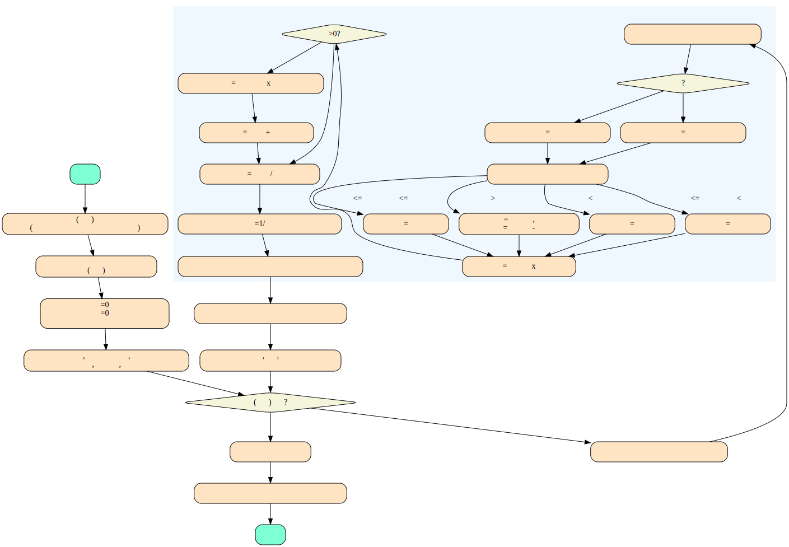
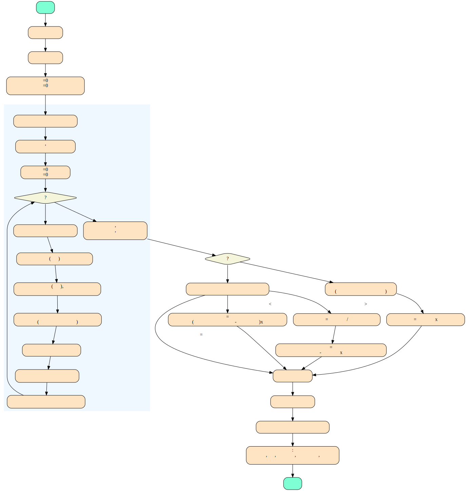
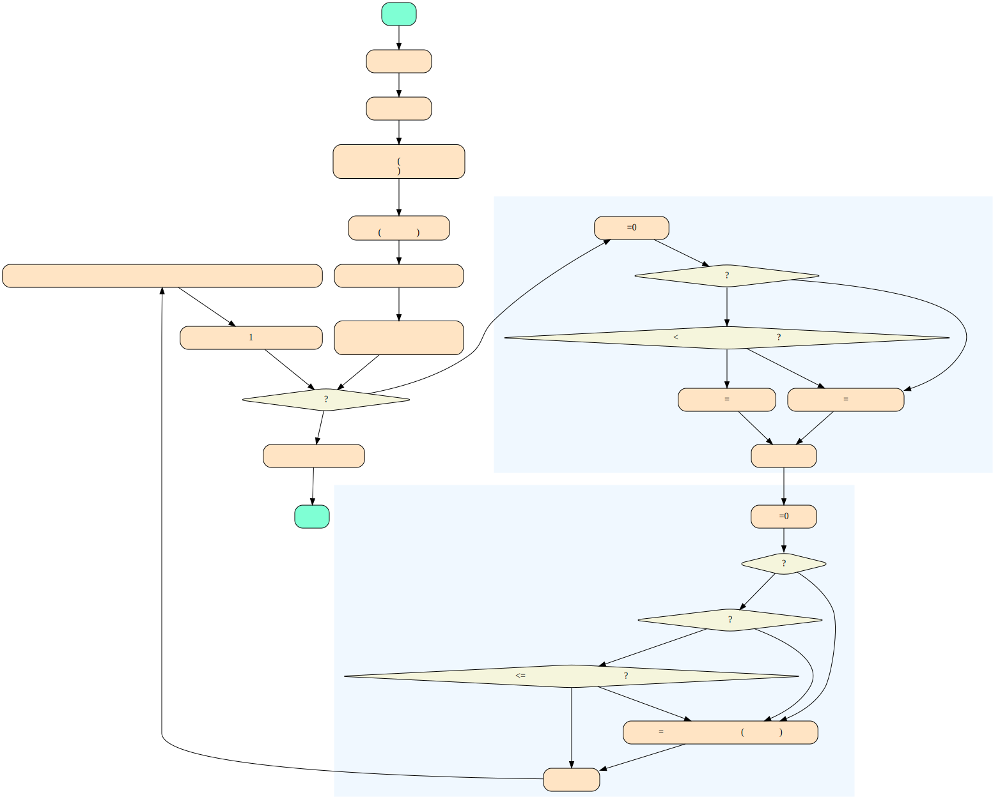

# 课时费计算

## 高中班课时费计算

   

## 其他班级课时费计算

   

* 关于多个教师同上1个班级的1次课的课时费以及“课次”的计算

  对于新教师，可能存在多个(目前都是2个)新老师同上一个班级的1次课

  * 课时费

    每个教师该次课的课时费按人数均分(e.g. 500 / 2 = 250)

  * 课次
    * 课次指的是"该次上课该教师的上课次数"
    * 多人合上1次课，每个教师的课次也是按人数均分
    * 这2个新教师，每个教师每次上课的"上课次数" = 1 / 2 = 0.5
    * 在之后按月计算1个教师的实际课时费的时候，会统计该教师的上课次数总和，就是每次计算累加的
    

## 教师的实际课时费(按月)
  
   

## 教师发生代课，薪资扣除以及代课费计算(按月)

   
