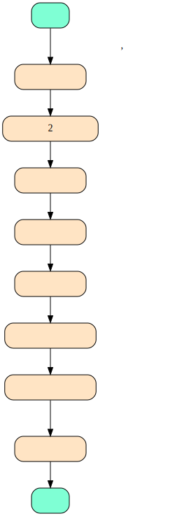

# 工作时间安排

## 全职员工每周总工作小时数

| 员工部门 | 每周总工作小时数 |
| :--: | :--: |
| 后勤 | 46.5 |
| 其他部门全职员工 | 42.5 |

## 教师工作时间分类

| 类型 | 安排优先级顺序 | 备注 |
| :--: | :--: | :--: |
| 上课时间 | 1 | 由课程安排时，指定教师来设置 |
| 休息时间 | 2 | 2个完整休息日安排后再进行后续工作时间安排 |
| 教研时间 | 3 | 在上课时间确定之后再安排 |
| 执勤时间 | 4 | | 
| 听课时间 | 5 | 新老师听课/教导监督听课 |
| 家长接待时间 | 6 | |
| 市场工作时间 | 7 | |
| 备课时间 | 8 | 剩下的时间即为备课时间 |

## 教师工作时间安排流程

